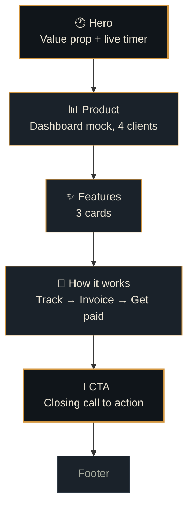

# ⏱ Stint

### A landing page for a time-tracking & invoicing product, built for freelancers who bill by the hour.

---

## What this is

**Stint** is an invented product: a time tracker that turns billable hours into
client-ready invoices automatically. This repo is its home page — one static
HTML file, built to earn the "wow, I want an account" reaction in the first
few seconds, with no fabricated stats, testimonials, or logos anywhere on it.

> *"Every minute, accounted for."*

---

## Design language

<table>
<tr><td width="50%" valign="top">

**Palette — ink & brass**

Built around a pocket-watch feel: dark ledger tones with a warm brass accent,
never the default AI cream-and-terracotta or neon-on-black look.

 `--ink` · background
 `--panel` · cards
 `--brass` · accent, CTA
 `--sage` · "paid" state
 `--rust` · warnings
 `--parchment` · text

</td><td width="50%" valign="top">

**Type system**

| Role | Typeface | Used for |
|---|---|---|
| Display | Bricolage Grotesque | Headlines |
| Body | Inter | Paragraph copy |
| Mono | IBM Plex Mono | Timer, numbers, labels |

Numbers get their own typeface on purpose — this is a product about counting
minutes and dollars, so the mono face shows up everywhere something is being
measured.

</td></tr>
</table>

---

## Page anatomy

### The signature element

The hero doesn't describe the product — it runs it. A live timer counts up in
real time next to a mock client name and hourly rate, so the first thing a
visitor sees is the product actually working, not a claim about what it does.

---

## Feature highlights

| | |
|---|---|
| ⏱ **Auto time capture** | A lightweight timer runs per client, so hours don't have to be reconstructed from memory on Friday. |
| 🧾 **One-click invoices** | Tracked hours become a formatted invoice instantly — no spreadsheet. |
| 📋 **Client-ready reports** | Every client gets a clean hours-and-cost breakdown, nothing to explain. |

---

## Interaction & motion

- **Live timer** — ticks every second in the hero, the page's one ambient animation
- **Scroll reveal** — sections fade/lift into view once, consistently, not scattered per-element
- **Dark / light toggle** — a full theme swap via CSS custom properties, all-or-nothing
- **Konami code** `↑ ↑ ↓ ↓ ← → ← → b a` — a small hidden toast, for anyone who tries it
- Respects `prefers-reduced-motion` — ticking and reveal animations disable cleanly

---

## Honesty constraint

No part of this page invents a user count, a testimonial, or a logo. The
dashboard section is clearly a **product demo** with sample data, not a
marketing claim about real customers. Every number visible on the page is
either a UI mock or standard, non-specific SaaS copy ("no credit card,
cancel anytime").

---

*Built as a design exercise — see `DECISIONS.md` for the reasoning behind each choice.*

